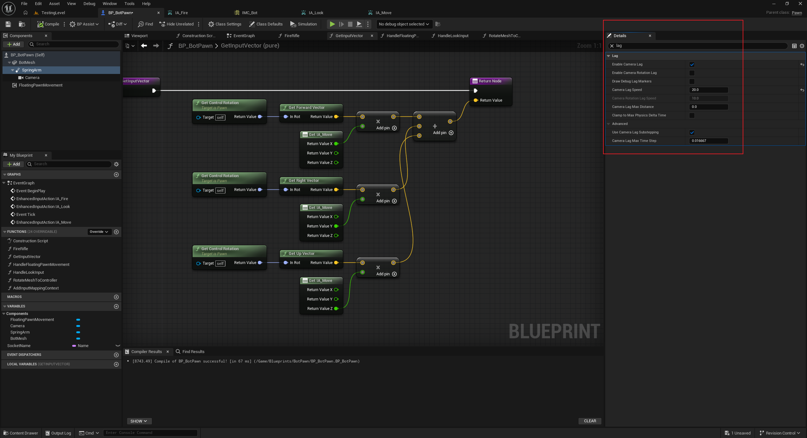

[text](c:/Users/yaojie/Downloads/ChatGPT-骨骼链命名对照表-20260815-0911.md)
我们可以使用 Add Controller 来实现 Look 功能，在这种情况下，需要将 Spring Arm 的 Use Pawn Control Rotation 设置为 true:

Spring Arm 有一个 Lag 功能，可以让摄像机延迟跟随 Arm：

